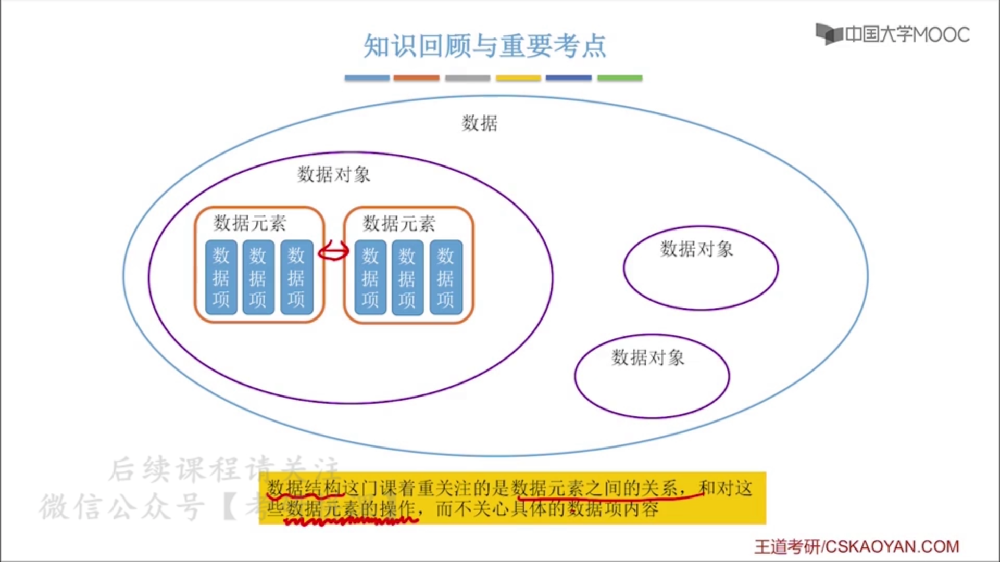
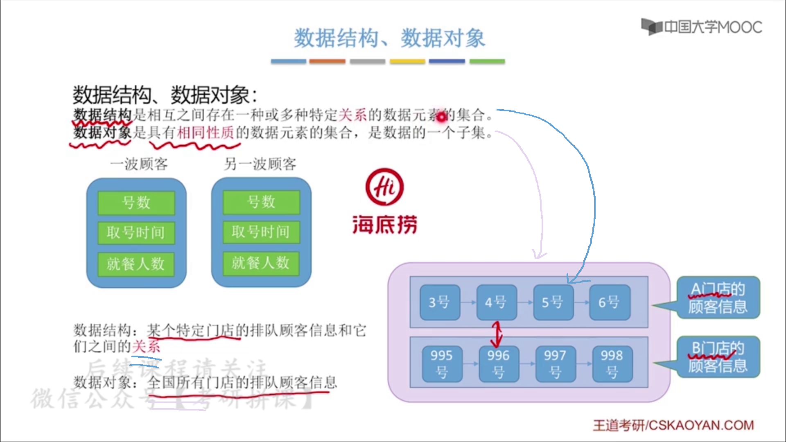
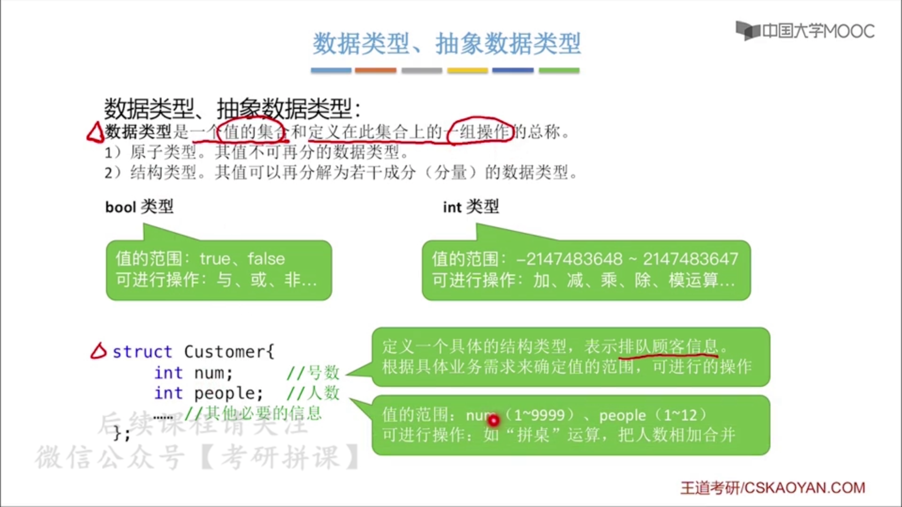
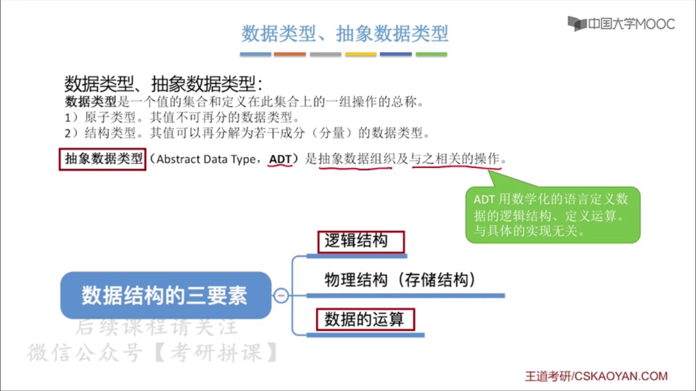
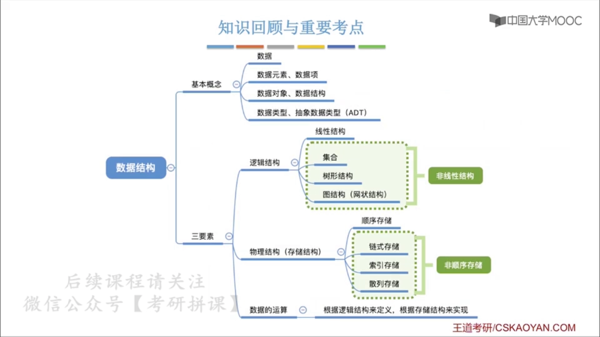

# 绪论

##  1 基本概念

### 1.1 数据

没实际意义，只是表示现实世界中的东西有部分可以被数据具象的表示。这些表示后的东西就被称为数据。

### 1.2 数据元素、数据项

要根据实际的业务需求来确定

* 数据元素：对象的概念，也就是类实例化后。例如：某个人。
* 数据项：类里的属性概念，例如：性别。

此外如果一个属性由多个属性组成，就称这个数据项是组合项，例如：年月日。

### 1.3 数据对象、数据结构

* 数据结构
  * 数据结构首先是数据元素的集合
  * 其次，数据结构这个集合中的数据元素之间要存在一种或多种**特定关系**
* 数据对象
  * 数据对象也是数据元素的集合
  * 数据对象不强调数据元素的关系，它只是一个集合
  * 数据对象可以被看成是抽象类

也就是说，数据对象和数据结构都是数据元素的集合，不同的是，数据对象关心的是里面存储了哪些数据元素，类似于：某个类实例化了哪些对象这种概念；而数据结构，关心的则是数据元素之间的关系，例如：线性表这种数据结构里的结点这种数据元素之间的线性关系。

我们在说线性表、队列时，就是在说数据结构。这些数据结构是抽象数据类型（ADT）的实现。

我们在此处说的数据结构只是对数据结构这个名词做的解释，是泛指。**3 数据结构**是对之后学习数据结构时怎样学进行的解释，是特定某种**抽象数据类型（ADT）**后的讨论。例如：我们在说“线性表”时，实际上是在说一种“抽象数据类型（ADT）”，因为此处关心的是指明我们要说哪种数据结构；我们说“线性表”里的“结点”时，是在说这种“数据结构”里的“数据元素”的名称，因为此处关心的是数据结构里的数据元素的关系。（2021年3月9日：此处有些混乱，但是没关系，没必要抓这么死，只要能在别人提到这些名词时知道对方在说什么就够了。）

### 1.4 数据类型、抽象数据类型（ADT）

#### 1.4.1 数据类型

一个值的集合和定义在此集合上的一组操作的总称呼。 有**值的范围**和**可进行的操作**。

#### 1.4.2 抽象数据类型（ADT）

在说明一种抽象数据类型（ADT）时，我们不关心它的实现。因此只讨论逻辑结构和数据的运算。

而我们要用某种语言实现它时，才是时候讨论物理结构，这时我们讨论的是数据结构。 

所以可以这么讲：我们讨论数据结构，就是在讨论**用某种存储结构实现的抽象数据类型（ADT）**。

## 2 三要素

我们讨论数据结构的时候，都会讨论该种数据结构的三要素，也就是以下三种：1. 逻辑结构；2. 存储结构；3. 数据的运算。**此处是对这三要素的名词解释，而并非给出什么实现。**

### 2.1 逻辑结构

#### 2.1.1 集合

* 各个元素同属一个集合，除此之外别无其他关系
* 内部元素直接互相不包含
* 而且无关系相连

#### 2.1.2 线性结构

* 元素之间关系是一对一的
* 除最先一个元素，其他所有元素都有唯一前驱
* 除最后一个元素，其他所有元素都有唯一后继

#### 2.1.3 树形结构

* 关系是一对多

#### 2.1.4 图状结构（网状结构）

* 关系是多对多

### 2.2 物理结构（存储结构）

如何用计算机表示出数据元素的逻辑关系。

#### 2.2.1 顺序存储

* 线性结构：数组（地址是连续的）

#### 2.2.2 链式存储

* 线性结构：链表（用指针来表示每个结点链接的结点）

#### 2.2.3 索引存储

* 线性结构：建立一张索引表，索引表会存放关键字和地址，也就是很多个键值对。数据库性质。

#### 2.2.4 散列存储（又称哈希存储，Hash）

* 线性结构：根据元素关键字直接计算出该元素的存储地址。第六章散列表有讲到。

#### 2.2.4 两个结论

1. 顺序存储是连续的。非顺序存储是离散的。
2. 存储结构影响**存储空间的方便程度。**
3. 存储结构影响**数据运算的速度。**

### 2.3 数据的运算

* 运算的定义：针对逻辑结构。
  * 是线性的，还是树形的，还是图状的？
  * 如果采用了线性的，那么它的功能如何用这种逻辑结构表示？例如：新来了一个人，那么从逻辑结构上分析就是多增加了一个结点
  * 重点关注的是**运算的功能**
* 运算的实现：针对存储结构。
  * 是用顺序实现，还是链式，还是索引，还是散列？
  * 如果采用了顺序实现，那功能应该如何具体的实现？
  * 重点关注的是**运算的具体操作步骤**

## 3 数据结构

我们在讨论某种特定数据结构时，实际上是在讨论下面三点，也就是三要素。前两点是在讨论抽象数据类型（ADT）。

1. 定义逻辑结构（怎么存）
   * 数据元素间的关系
2. 定义数据运算（怎么操作）
   * 进行怎样的运算（增删改查）
   * 此时还只关注**运算的定义**
3. 确定存储结构（怎么存进电脑）
   * 实现数据结构，也就是物理结构（存储结构）
   * 实现基本运算，此时关注**运算的实现**

例如：

我们在讨论线性表时，讨论的是线性表的抽象数据类型（ADT），也就是它的逻辑结构和数据运算。逻辑结构是线性的，数据运算有最基本的增删改查。而实现线性表有顺序存储实现（数列）、链式存储实现（指针结点）等。

## 4 总结

